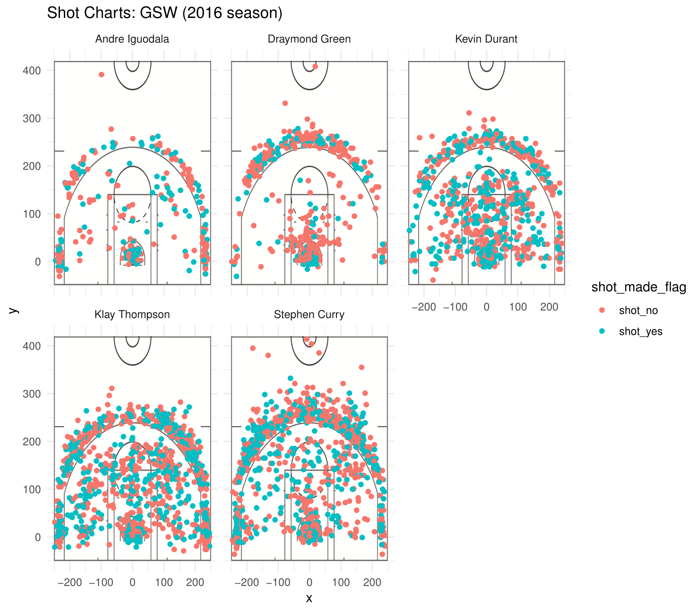

report
================
Jack Tseng

Introduction
============

Considered the best superteam in the NBA in recent years, the Golden State Warriors had arguably the best starting five in the Western Conference, and maybe even the entire NBA. In the 2015-2016 the Warriors had a historic 73 win season, largely because of high efficiency shooting and scoring (Thompson and Curry aptly referred to as the Splash Brothers because of the large volume and accuracy of three point shots made). This is a visual demonstration and report of the shot data of each of the Warriors' starting five, combining shot charts with summaries and other visualizations to create a comprehensive overview of each player's performance.

Breaking Down Each Player's Performance
=======================================

The point guard of this team, Stephen Curry, is considered one of, if not the, best shooter in NBA history. His ability to score from everywhere on the floor (his scoring from inside the restricted area, to midrange, to 3 point territory are all similar), not to mention his affinity for shots way behind the three point line. His high volume of scoring is one aspect that helps Golden State retain such a high offensive efficiency.

Shooting Guard Klay Thompson is no slouch either. The other half of the Splash Brothers duo (the other being Stephen Curry), Thompson also displays extreme skill in knocking down three pointers. Thompson is more of a specialist shooter compared to Curry, a designated sharpshooter whose 3 point percentage is even higher than Curry's (at over 42 percent), as we see in the visualized data below. Thompson is also an elite defender that helps Golden State on the defensive end.

Forward Kevin Durant is an absolute scoring machine. His ability to knock down shots from everywhere on the court mirrors Curry's, and with a shooting percentage of over 54 percent, Durant boasts the highest shooting percentage on this team. Another two way player in addition to Thompson, Durant helps this team in many ways, namely defense and playmaking, in addition to scoring as we see in the charts below.

Forward Andre Iguodala has the highest two pointer shooting percentage, but given that he mainly operates close to the rim for easy lay-ups and dunks (with the occasional midrange shot, which he is quite good at), his offensive stats aren't quite as good as the Durant, Curry, and Thompson. However, Iguodala is a great defender that can switch onto many positions, offering defensive utility and flexibility.

Center/ Forward Draymond Green is another player whose efforts aren't reflected in just scoring numbers. His playmaking, rebounding, and defense make him critical to Golden State's style of play, and without Green the style would be very different. Green is also no slouch offensively, but his jack of all trades style certainly benefits Golden State in ways other than scoring which may not be seen in the graphs below.

``` r
#libraries
library(jpeg)
library(grid)
library(dplyr)
```

    ## 
    ## Attaching package: 'dplyr'

    ## The following objects are masked from 'package:stats':
    ## 
    ##     filter, lag

    ## The following objects are masked from 'package:base':
    ## 
    ##     intersect, setdiff, setequal, union

``` r
library(ggplot2)
library(readr)
```

2 pointers
==========

    ## # A tibble: 5 x 4
    ##   name           total  made perc_made
    ##   <chr>          <int> <int>     <dbl>
    ## 1 Andre Iguodala   210   134     0.638
    ## 2 Kevin Durant     643   390     0.607
    ## 3 Stephen Curry    563   304     0.540
    ## 4 Klay Thompson    640   329     0.514
    ## 5 Draymond Green   346   171     0.494

3 pointers
==========

    ## # A tibble: 5 x 4
    ##   name           total  made perc_made
    ##   <chr>          <int> <int>     <dbl>
    ## 1 Klay Thompson    580   246     0.424
    ## 2 Stephen Curry    687   280     0.408
    ## 3 Kevin Durant     272   105     0.386
    ## 4 Andre Iguodala   161    58     0.360
    ## 5 Draymond Green   232    74     0.319

shooting percentage
===================

``` r
all_points <- shots_data[ , c("name", "shot_made_flag")] %>% group_by(name) %>% summarise(total = n(), made = sum(shot_made_flag == "shot_yes")) %>% mutate(perc_made = made/total) %>% arrange(desc(perc_made))
all_points
```

    ## # A tibble: 5 x 4
    ##   name           total  made perc_made
    ##   <chr>          <int> <int>     <dbl>
    ## 1 Kevin Durant     915   495     0.541
    ## 2 Andre Iguodala   371   192     0.518
    ## 3 Klay Thompson   1220   575     0.471
    ## 4 Stephen Curry   1250   584     0.467
    ## 5 Draymond Green   578   245     0.424



Overall, the Golden State Warriors are definitely a great team to support, and given they win so much they certainly won't be a bore to watch. With world class talent on both ends of the floor, the Warriors will certainly be fun and interesting to follow!
